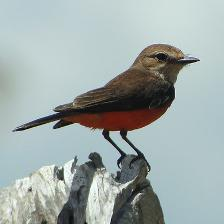

# Distortion Classfication

## Data Generation
The data was generated using `java/DistortImage/src/image/DistortImage.java`.  This process downloaded images from ImageNet, sized down the image to 224x224 pixels, and applied a series of six distortions on each image.

Original Image: 

Gaussian (Smooth) Blur:

Motion Blur:

Non-Monochrome Gaussian Noise:

Monochrome Gaussian Noise:

Marble:

Twirl:

## Basline Model
We trained a softmax regression model as a baseline using `softmaxRegression/softmax.py`.

## Transfer Learning Model
We fine tuned VGG16 model using `transferLearning/vgg16.py`.

## Saved Models
Saved models are in `models/`--only the ones under the GitHub 100MB file size limit.