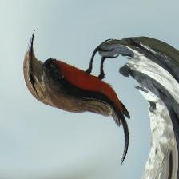

# Distortion Classfication

## Data Generation
The data was generated using `java/DistortImage/src/image/DistortImage.java`.  This process downloaded images from ImageNet, sized down the image to 224x224 pixels, and applied a series of six distortions on each image.

Original Image: 

Gaussian (Smooth) Blur:

Motion Blur:

Non-Monochrome Gaussian Noise:

Monochrome Gaussian Noise:

Marble:

Twirl:

## Basline Model
We trained a softmax regression model as a baseline using `softmaxRegression/softmax.py`.

## VGG16 Scratch Model
We trained VGG16 model from scratch using `vgg16/vgg16_baseline.py`.\
Scripts for evaluation of the VGG16 models are in 'vgg16'.

## Generic Transfer Learning Model
We fine tuned VGG16 model using `transferLearningVGG16/transfer_vgg16.py`.\
Scripts for evaluation and error analysis of the VGG16 models are in 'transferLearningVGG16'.

## IQA Transfer Learning Model
We fine tuned SGDNet model using `sgdnet_transfer/transfer_sgdnet.py`.
Scripts for evaluation and error analysis of the SGDNet transferred models are in 'sgdnet_transfer'.

## Saved Models
Saved models are in `models/`--only the ones under the GitHub 100MB file size limit.
